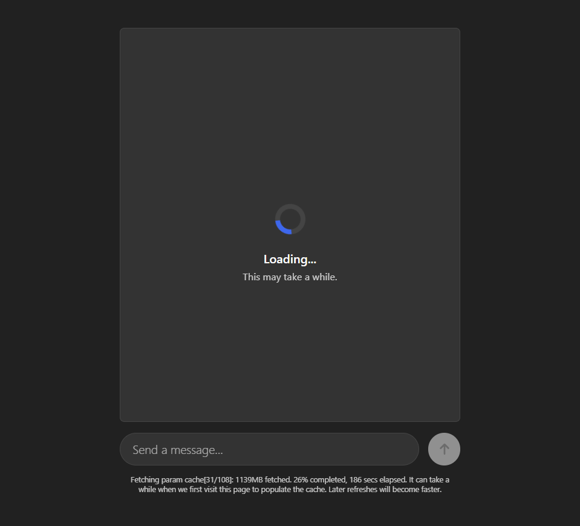
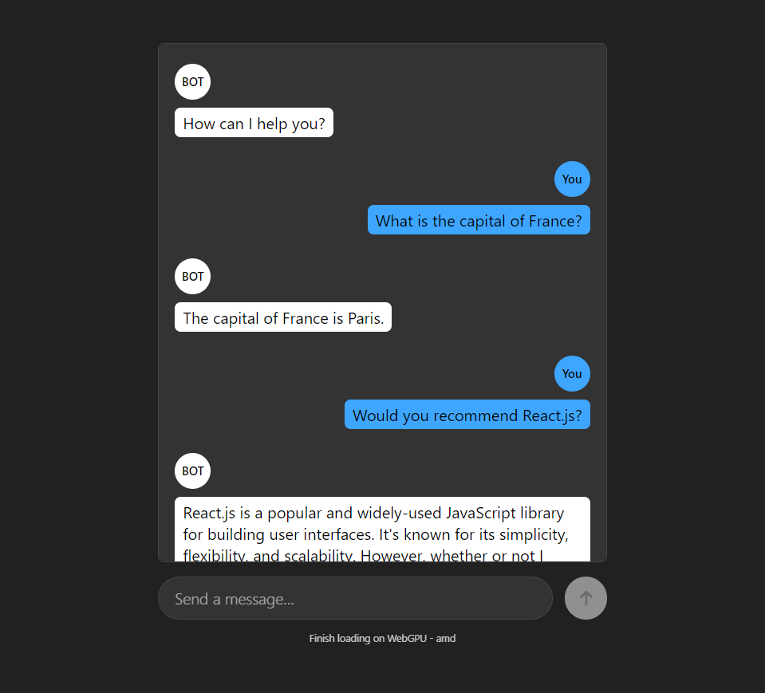

# Local-LLM

## Table of Contents
1. [Overview](#overview)
2. [Enabling Web Storage](#enabling-web-storage)
3. [Demonstration](#demonstration)
4. [What have I learned?](#what-have-i-learned)

## Overview

Local-LLM leverages the `LLaMA-3-8B-Instruct-q4f32_1-MLC-1k` language model from [WebLLM](https://webllm.mlc.ai/) for local execution. Enhancing privacy and reducing server dependency, all the data is efficiently cached in the browser.

## Enabling Web Storage

To use Local-LLM, it is essential to ensure that web storage is enabled in your browser. **Without this feature enabled, Local-LLM will not function correctly**.

For example, in [Google Chrome](https://www.google.com/intl/es_es/chrome/?brand=FHFK&ds_kid=43700059038707842&gad_source=1&gclid=CjwKCAjwjqWzBhAqEiwAQmtgT4ZZE9KZ42svyJcj1LFmz8tLq8hJiIpJE0kN72jQVTO906Xkr16SeRoCqGkQAvD_BwE&gclsrc=aw.ds), it would be done by performing the following steps:

1. Click on the menu button in the top-right corner of your Chrome window.
2. Select “Settings” from that menu.
3. Click “Cookies and site permissions”.
4. Click on “Cookies and site data”.
5. Toggle on the setting for “Allow sites to save and read cookie data (recommended)”.

## Demonstration

    
    

> https://local-llm.vercel.app/

## What have I learned?

Through developing Local-LLM, several key learnings have emerged:

- Integration of [ECMAScript modules](https://nodejs.org/api/esm.html) for efficient code structuring.
- Handling form events dynamically to enhance user interaction.
- Implementing [HTML templates](https://developer.mozilla.org/en-US/docs/Web/HTML/Element/template) for flexible DOM manipulation.
- Utilizing [Web Workers](https://developer.mozilla.org/en-US/docs/Web/API/Web_Workers_API/Using_web_workers) to optimize performance and offload intensive tasks.
- Executing a language model directly in the browser environment, exploring its feasibility and performance characteristics.